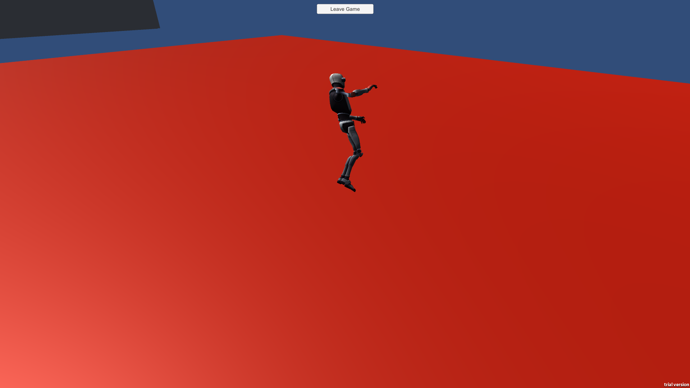
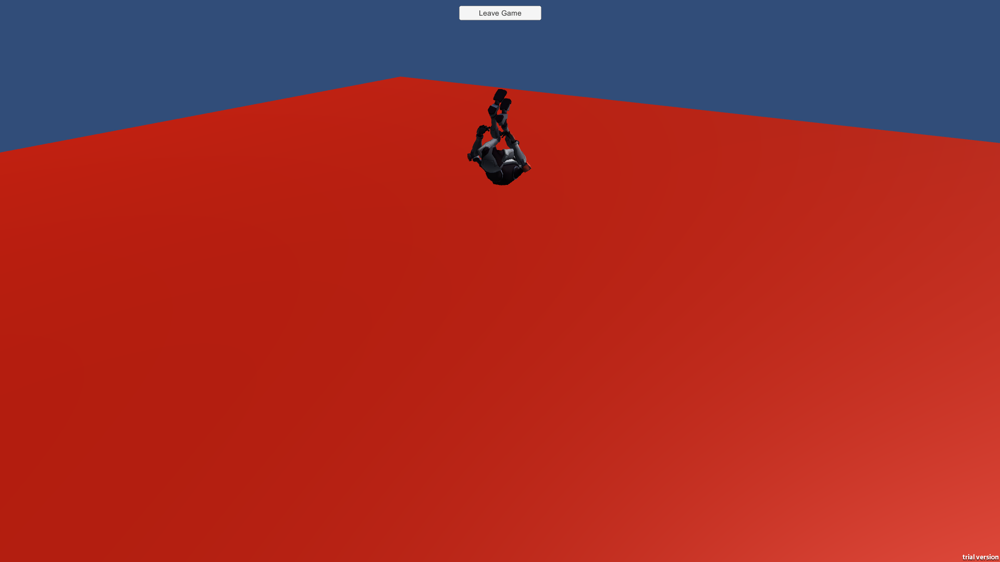

# PhotonEnginePractice
In this project I am following along with the Photon Engine tutorial using PUN. 

### Lobby Implementation
My current lobby implementation differs slightly from their own. 
I intend on creating a game with just two players, so I decided to forgo 
implementing multiple rooms that fit the naming schema they suggest. 

The user is met with a simple launch screen 

This launch screen remembers the users last entered username. 
Just below the user name, there is a play button which loads the user into the play room using PUN.

### Player Implementation
The player is instantiated from a prefab 
This prefab is instanced and put into a room by Pun allowing me to synchronize the player across all clients. 

I disliked how the tutorial implemented their lasers, you were able to hit yourself 
I fixed this issue by just checking if the collision happened to be with its own collider. 
The player is also able to jump, given that they are already running 

